# System Overview Architecture

This diagram shows the high-level system architecture including the Next.js frontend (separate project), backend services, and external integrations.

```mermaid
graph TD
    %% Frontend Layer
    subgraph "Frontend (Next.js - Separate Project)"
        FE[Next.js Frontend]
    end

    %% API Gateway / Load Balancer
    subgraph "API Layer"
        LB[Load Balancer]
        API1[Backend API Instance 1]
        API2[Backend API Instance 2]
        API3[Backend API Instance N]
    end

    %% Core Backend Services
    subgraph "Teamcast Backend Service"
        subgraph "Controllers"
            AC[Auth Controller]
            CC[Client Controller]
            CandC[Candidate Controller]
            PC[Partner Controller]
            SC[Support Controller]
        end

        subgraph "Services"
            AS[Auth Service]
            CS[Client Service]
            CandS[Candidate Service]
            PS[Partner Service]
            SS[Support Service]
            AIS[AI Services]
            IS[Integration Service]
            NS[Notification Service]
        end

        subgraph "AI/ML Services"
            AIF[AI Factory]
            RP[Resume Parser]
            RA[Resume Assessment]
            JP[Job Parser]
            JA[Job Assessment]
            VA[Video Analysis]
            CR[Candidate Recommendation]
        end
    end

    %% Data Layer
    subgraph "Data Layer"
        PG[(PostgreSQL<br/>Primary Database)]
        REDIS[(Redis<br/>Cache & Queue)]
        GCS[Google Cloud Storage<br/>File Storage]
    end

    %% External Services
    subgraph "External AI Services"
        VERTEX[Google Cloud Vertex AI]
        GEMINI[Gemini Pro Models]
        EMBEDDING[Text Embedding 005]
    end

    subgraph "External Integrations"
        BREVO[Brevo<br/>Email Service]
        STRIPE[Stripe<br/>Payments]
        OAUTH[OAuth Providers<br/>Google, GitHub]
    end

    subgraph "Monitoring & Observability"
        PROM[Prometheus<br/>Metrics]
        GRAF[Grafana<br/>Dashboards]
        ALERT[AlertManager<br/>Alerting]
    end

    %% Connections
    FE -->|HTTPS/REST API| LB
    LB --> API1
    LB --> API2
    LB --> API3

    API1 --> AC
    API1 --> CC
    API1 --> CandC
    API1 --> PC
    API1 --> SC

    AC --> AS
    CC --> CS
    CandC --> CandS
    PC --> PS
    SC --> SS

    AS --> PG
    CS --> PG
    CandS --> PG
    PS --> PG
    SS --> PG

    AIS --> AIF
    AIF --> RP
    AIF --> RA
    AIF --> JP
    AIF --> JA
    AIF --> VA
    AIF --> CR

    API1 --> REDIS
    API2 --> REDIS
    API3 --> REDIS

    AS --> KC
    AS --> OAUTH
    NS --> BREVO
    CS --> STRIPE
    IS --> GCS

    AIS --> VERTEX
    AIS --> GEMINI
    AIS --> EMBEDDING

    API1 --> PROM
    PROM --> GRAF
    PROM --> ALERT
```

## Key Architecture Principles

- **Separation of Concerns**: Clear layered architecture with controllers, services, and data access
- **Singleton Pattern**: Services implemented as singletons for efficient resource management
- **Factory Pattern**: AI services use factory pattern for provider abstraction
- **Microservices Ready**: Modular design enables future microservices migration
- **Cloud Native**: Built for containerization and Kubernetes deployment
