# AI/ML Services Architecture

This diagram shows the detailed AI processing pipeline including document processing, assessment services, and AI provider integration.

```mermaid
graph TD
    %% User Inputs
    subgraph "User Inputs"
        RESUME[Resume Document]
        JOB[Job Description]
        CANDIDATE[Candidate Profile]
        VIDEO[Video Interview]
    end

    %% AI Service Factory
    subgraph "AI Service Factory Pattern"
        AF[AI Factory]
        LPF[Local Provider Factory]
        GPF[GCP Vertex Provider Factory]
    end

    %% AI Processing Services
    subgraph "Document Processing Services"
        subgraph "Resume Processing"
            RPS[Resume Parser Service]
            RAS[Resume Assessment Service]
            RPP[Resume Parser Provider]
            RAP[Resume Assessment Provider]
        end

        subgraph "Job Processing"
            JPS[Job Parser Service]
            JAS[Job Assessment Service]
            JPP[Job Parser Provider]
            JAP[Job Assessment Provider]
        end
    end

    %% Assessment Services
    subgraph "AI Assessment Services"
        subgraph "Job AI Assessment"
            JAAS[Job AI Assessment Service]
            JAAP[Job AI Assessment Provider]
        end

        subgraph "Onboarding Assessment"
            OAS[Onboarding Assessment Service]
            OAP[Onboarding Assessment Provider]
        end

        subgraph "Video Analysis"
            VAS[Video Analysis Service]
            VAP[Video Analysis Provider]
        end
    end

    %% Recommendation Engine
    subgraph "Recommendation Engine"
        subgraph "Candidate Recommendation"
            CRS[Candidate Recommendation Service]
            CRP[Candidate Recommendation Provider]
        end

        subgraph "Job Recommendation"
            JRS[Job Recommendation Service]
            JRP[Job Recommendation Provider]
        end
    end

    %% RAG System
    subgraph "RAG (Retrieval Augmented Generation)"
        RAGS[RAG Service]
        RAGP[RAG Provider]
        VECTOR[Vector Database]
        EMBED[Embedding Service]
    end

    %% External AI Providers
    subgraph "External AI Providers"
        subgraph "Google Cloud Vertex AI"
            GEMINI[Gemini Pro]
            GEMINI_VISION[Gemini Pro Vision]
            TEXT_EMBEDDING[Text Embedding 005]
            CHAT_BISON[Chat Bison]
        end

        subgraph "Alternative Providers"
            OPENAI[OpenAI GPT]
            AZURE[Azure OpenAI]
            ANTHROPIC[Anthropic Claude]
        end
    end

    %% Data Storage
    subgraph "AI Data Storage"
        AI_CACHE[(Redis Cache)]
        AI_LOGS[(AI Processing Logs)]
        EMBEDDINGS[(Vector Embeddings)]
        MODEL_CACHE[(Model Cache)]
    end

    %% Connections - User Inputs to Services
    RESUME --> RPS
    JOB --> JPS
    CANDIDATE --> JAAS
    VIDEO --> VAS

    %% Factory Pattern Connections
    AF --> LPF
    AF --> GPF

    %% Service to Provider Connections
    RPS --> RPP
    RAS --> RAP
    JPS --> JPP
    JAS --> JAP
    JAAS --> JAAP
    OAS --> OAP
    VAS --> VAP
    CRS --> CRP
    JRS --> JRP
    RAGS --> RAGP

    %% Provider to Factory Connections
    RPP --> AF
    RAP --> AF
    JPP --> AF
    JAP --> AF
    JAAP --> AF
    OAP --> AF
    VAP --> AF
    CRP --> AF
    JRP --> AF
    RAGP --> AF

    %% Factory to External Providers
    GPF --> GEMINI
    GPF --> GEMINI_VISION
    GPF --> TEXT_EMBEDDING
    GPF --> CHAT_BISON

    LPF --> OPENAI
    LPF --> AZURE
    LPF --> ANTHROPIC

    %% RAG System Connections
    RAGS --> VECTOR
    RAGS --> EMBED
    EMBED --> TEXT_EMBEDDING

    %% Caching Connections
    RPS --> AI_CACHE
    JPS --> AI_CACHE
    JAAS --> AI_CACHE
    CRS --> AI_CACHE

    %% Logging Connections
    RPP --> AI_LOGS
    RAP --> AI_LOGS
    JPP --> AI_LOGS
    JAP --> AI_LOGS

    %% Embedding Storage
    EMBED --> EMBEDDINGS
    TEXT_EMBEDDING --> MODEL_CACHE
```

## AI/ML Architecture Principles

### Factory Pattern Implementation

- **AI Factory**: Central factory for creating AI providers
- **Provider Abstraction**: Clean separation between service logic and AI providers
- **Multi-Provider Support**: Easy switching between different AI services (GCP, OpenAI, etc.)

### Document Processing Pipeline

1. **Resume Parser**: Extracts structured data from resume documents
2. **Resume Assessment**: Evaluates candidate skills and experience
3. **Job Parser**: Analyzes job descriptions for requirements
4. **Job Assessment**: Matches job requirements with candidate profiles

### Assessment Services

- **Job AI Assessment**: AI-powered technical and behavioral assessments
- **Onboarding Assessment**: New hire evaluation and cultural fit analysis
- **Video Analysis**: Interview video processing with sentiment analysis

### Recommendation Engine

- **Candidate Recommendation**: ML-based candidate matching for jobs
- **Job Recommendation**: Personalized job suggestions for candidates
- **RAG Integration**: Context-aware recommendations using retrieval augmented generation

### Caching Strategy

- **Redis Cache**: High-performance caching for AI responses
- **Model Cache**: Cached model outputs to reduce API calls
- **Vector Cache**: Optimized storage for embedding vectors
- **Processing Logs**: Comprehensive logging for AI operations
