# Database Schema - Entity Relationship Diagram

This diagram shows the core database schema with the main entities and their relationships using Prisma ORM.

```mermaid
erDiagram
    %% Core User System
    user {
        string id PK
        string name
        string email UK
        string type "SUPPORT|CANDIDATE|CLIENT|PARTNER"
        string role "ADMIN|HR|RECRUITER|ACCOUNTS|PARTNER_RESOURCE|INDIVIDUAL"
        string status "ACTIVE|INACTIVE|BLOCKED"
        string jobTitle
        datetime emailVerified
        datetime createdAt
        datetime updatedAt
    }

    %% User Type Extensions
    candidate {
        string id PK
        string userId FK
        string status "NEW|ONBOARDED|REJECTED|HIRED"
        string assessmentStage
        string jobSearchStatus
        boolean isPublished
        int completionPercentage
        datetime createdAt
    }

    client_user {
        string id PK
        string clientId FK
        string userId FK
        datetime createdAt
    }

    partner_user {
        string id PK
        string partnerId FK
        string userId FK
        datetime createdAt
    }

    support_user {
        string id PK
        string userId FK
        datetime createdAt
    }

    %% Company System
    company {
        string id PK
        string name
        string description
        string type "STARTUP|SCALE_UP|ENTERPRISE|SME|CORPORATION"
        string industry
        string website
        string location
        int size
        datetime createdAt
    }

    client {
        string id PK
        string companyId FK
        string status "ACTIVE|INACTIVE|SUSPENDED"
        datetime createdAt
    }

    partner {
        string id PK
        string companyId FK
        string status "ACTIVE|INACTIVE|SUSPENDED"
        datetime createdAt
    }

    %% Job System
    job_posting {
        string id PK
        string clientId FK
        string title
        string description
        string requirements
        string location
        string workType "FULL_TIME|PART_TIME|CONTRACT|INTERNSHIP"
        string status "DRAFT|PUBLISHED|CLOSED|PAUSED"
        decimal salaryMin
        decimal salaryMax
        datetime deadline
        datetime createdAt
    }

    job_application {
        string id PK
        string jobPostingId FK
        string candidateId FK
        string status "APPLIED|SHORTLISTED|REJECTED|HIRED"
        datetime appliedAt
        datetime statusUpdatedAt
    }

    %% AI Assessment System
    ai_assessment {
        string id PK
        string jobPostingId FK
        string candidateId FK
        string status "NOT_STARTED|IN_PROGRESS|COMPLETED|EXPIRED"
        string result "PASS|FAIL|PENDING"
        decimal score
        string recommendation "HIGHLY_RECOMMENDED|RECOMMENDED|NOT_RECOMMENDED"
        datetime startedAt
        datetime completedAt
    }

    ai_assessment_question {
        string id PK
        string assessmentId FK
        string questionText
        string questionType "MULTIPLE_CHOICE|OPEN_ENDED|CODING|VIDEO"
        json options
        string candidateAnswer
        decimal score
        string feedback
    }

    ai_assessment_video_analysis {
        string id PK
        string assessmentId FK
        string videoUrl
        json facialAnalysis
        json speechAnalysis
        json sentimentAnalysis
        json behaviorAnalysis
        datetime analyzedAt
    }

    %% Onboarding Assessment System
    onboarding_assessment {
        string id PK
        string candidateId FK
        string status "NOT_STARTED|IN_PROGRESS|COMPLETED"
        string result "PASS|FAIL|PENDING"
        decimal overallScore
        datetime startedAt
        datetime completedAt
    }

    onboarding_assessment_section {
        string id PK
        string assessmentId FK
        string type "SKILLS|PERSONALITY|CULTURAL_FIT|TECHNICAL|VIDEO_INTERVIEW"
        string name
        decimal score
        string status "NOT_STARTED|IN_PROGRESS|COMPLETED"
    }

    %% Candidate Profile Extensions
    resume {
        string id PK
        string candidateId FK
        string fileName
        string fileUrl
        json parsedData
        json skillsExtracted
        json experienceExtracted
        datetime uploadedAt
    }

    education {
        string id PK
        string candidateId FK
        string institution
        string degree
        string fieldOfStudy
        datetime startDate
        datetime endDate
        decimal gpa
    }

    experience {
        string id PK
        string candidateId FK
        string company
        string title
        string description
        datetime startDate
        datetime endDate
        boolean isCurrent
    }

    certification {
        string id PK
        string candidateId FK
        string name
        string issuer
        datetime issuedDate
        datetime expiryDate
        string credentialUrl
    }

    %% Subscription System
    client_subscription {
        string id PK
        string clientId FK
        string packageId FK
        string status "ACTIVE|INACTIVE|EXPIRED|CANCELLED"
        int creditsRemaining
        datetime startDate
        datetime endDate
        datetime createdAt
    }

    candidate_subscription {
        string id PK
        string candidateId FK
        string packageId FK
        string status "ACTIVE|INACTIVE|EXPIRED|CANCELLED"
        int creditsRemaining
        datetime startDate
        datetime endDate
        datetime createdAt
    }

    %% Settings System
    global_settings {
        string id PK
        json aiAssessmentSettings
        json notificationSettings
        json securitySettings
        datetime updatedAt
    }

    client_settings {
        string id PK
        string clientId FK
        boolean notificationsEnabled
        boolean emailNotifications
        boolean jobAlerts
        boolean candidateAlerts
        json customSettings
    }

    candidate_settings {
        string id PK
        string candidateId FK
        boolean profilePublic
        boolean jobAlertsEnabled
        boolean emailNotifications
        json preferences
    }

    %% Relationships
    user ||--o{ candidate : "has profile"
    user ||--o{ client_user : "belongs to client"
    user ||--o{ partner_user : "belongs to partner"
    user ||--o{ support_user : "is support staff"

    company ||--o{ client : "is client"
    company ||--o{ partner : "is partner"

    client ||--o{ client_user : "has users"
    client ||--o{ job_posting : "posts jobs"
    client ||--o{ client_subscription : "has subscription"
    client ||--o{ client_settings : "has settings"

    partner ||--o{ partner_user : "has users"

    candidate ||--o{ job_application : "applies to jobs"
    candidate ||--o{ ai_assessment : "takes assessments"
    candidate ||--o{ onboarding_assessment : "completes onboarding"
    candidate ||--o{ resume : "uploads resumes"
    candidate ||--o{ education : "has education"
    candidate ||--o{ experience : "has experience"
    candidate ||--o{ certification : "has certifications"
    candidate ||--o{ candidate_subscription : "has subscription"
    candidate ||--o{ candidate_settings : "has settings"

    job_posting ||--o{ job_application : "receives applications"
    job_posting ||--o{ ai_assessment : "requires assessment"

    ai_assessment ||--o{ ai_assessment_question : "contains questions"
    ai_assessment ||--o{ ai_assessment_video_analysis : "includes video analysis"

    onboarding_assessment ||--o{ onboarding_assessment_section : "contains sections"
```

## Database Architecture Principles

### Multi-Tenant Design

- **User Type Polymorphism**: Single user table with type-specific extensions
- **Company Abstraction**: Base company entity with client/partner specializations
- **Role-Based Access**: Hierarchical user roles for fine-grained permissions

### Assessment System Design

- **Dual Assessment Types**: Separate job-specific and onboarding assessments
- **Modular Structure**: Sectioned assessments for different evaluation types
- **Rich Analytics**: Comprehensive video and behavioral analysis storage

### Subscription Management

- **Multi-Entity Subscriptions**: Both clients and candidates can have subscriptions
- **Credit-Based System**: Flexible credit allocation for various platform features
- **Package Flexibility**: Configurable subscription packages per user type

### Settings Architecture

- **Global Defaults**: System-wide settings with entity-specific overrides
- **Granular Control**: Per-entity customization for notifications and preferences
- **JSON Flexibility**: Extensible settings storage for future features

### Data Integrity

- **Foreign Key Constraints**: Strict referential integrity across all relationships
- **Soft Deletes**: Preserved data history for analytics and compliance
- **Audit Trails**: Comprehensive tracking of data modifications
- **Index Optimization**: Strategic indexing for query performance
