# Infrastructure & Deployment Architecture

This diagram shows the cloud infrastructure and Kubernetes deployment architecture for the Teamcast backend service.

```mermaid
graph TB
    %% External Users
    subgraph "Users"
        CANDIDATES[Candidates]
        CLIENTS[Clients]
        PARTNERS[Partners]
        ADMIN[Administrators]
    end

    %% Load Balancer & CDN
    subgraph "Edge Layer"
        CDN[CDN / CloudFlare]
        ALB[Application Load Balancer]
    end

    %% Kubernetes Cluster
    subgraph "Kubernetes Cluster"
        subgraph "Ingress"
            NGINX[NGINX Ingress Controller]
        end

        subgraph "Application Pods"
            subgraph "Backend Services"
                POD1[Backend Pod 1]
                POD2[Backend Pod 2]
                POD3[Backend Pod N]
            end

            subgraph "Worker Pods"
                WORKER1[Queue Worker 1]
                WORKER2[Queue Worker 2]
                WORKERN[Queue Worker N]
            end
        end

        subgraph "Service Mesh"
            ISTIO[Istio Service Mesh]
            ENVOY[Envoy Proxies]
        end

        subgraph "Configuration"
            CONFIGMAP[ConfigMaps]
            SECRETS[Secrets]
            SERVICEACCOUNT[Service Accounts]
        end
    end

    %% Database Layer
    subgraph "Managed Database Services"
        subgraph "PostgreSQL Cluster"
            PG_PRIMARY[(PostgreSQL Primary)]
            PG_REPLICA[(PostgreSQL Read Replica)]
            PG_BACKUP[(Automated Backups)]
        end

        subgraph "Redis Cluster"
            REDIS_MASTER[(Redis Master)]
            REDIS_SLAVE[(Redis Slaves)]
            REDIS_SENTINEL[(Redis Sentinel)]
        end
    end

    %% Google Cloud Services
    subgraph "Google Cloud Platform"
        subgraph "AI/ML Services"
            VERTEX[Vertex AI]
            GEMINI[Gemini Pro API]
            EMBEDDING[Text Embedding API]
        end

        subgraph "Storage Services"
            GCS[Cloud Storage]
            FILESTORE[Filestore]
        end

        subgraph "Security Services"
            IAM[Identity & Access Management]
            KMS[Key Management Service]
            SECRETMANAGER[Secret Manager]
        end
    end

    %% External Services
    subgraph "External Integrations"
        BREVO[Brevo Email Service]
        STRIPE[Stripe Payment Gateway]
        OAUTH_PROVIDERS[OAuth Providers<br/>Google, GitHub]
    end

    %% Monitoring & Observability
    subgraph "Monitoring Stack"
        subgraph "Metrics & Alerting"
            PROMETHEUS[Prometheus]
            GRAFANA[Grafana]
            ALERTMANAGER[AlertManager]
        end

        subgraph "Logging"
            FLUENTD[Fluentd]
            ELASTICSEARCH[Elasticsearch]
            KIBANA[Kibana]
        end

        subgraph "Tracing"
            JAEGER[Jaeger]
            ZIPKIN[Zipkin]
        end
    end

    %% CI/CD Pipeline
    subgraph "CI/CD Infrastructure"
        subgraph "Source Control"
            GITHUB[GitHub Repository]
            GITHUB_ACTIONS[GitHub Actions]
        end

        subgraph "Container Registry"
            GCR[Google Container Registry]
            DOCKER_HUB[Docker Hub]
        end

        subgraph "Deployment"
            ARGOCD[ArgoCD]
            HELM[Helm Charts]
        end
    end

    %% Connections
    CANDIDATES --> CDN
    CLIENTS --> CDN
    PARTNERS --> CDN
    ADMIN --> CDN

    CDN --> ALB
    ALB --> NGINX

    NGINX --> ISTIO
    ISTIO --> ENVOY

    ENVOY --> POD1
    ENVOY --> POD2
    ENVOY --> POD3

    POD1 --> WORKER1
    POD2 --> WORKER2
    POD3 --> WORKERN

    POD1 --> PG_PRIMARY
    POD2 --> PG_PRIMARY
    POD3 --> PG_PRIMARY

    POD1 --> PG_REPLICA
    POD2 --> PG_REPLICA
    POD3 --> PG_REPLICA

    POD1 --> REDIS_MASTER
    POD2 --> REDIS_MASTER
    POD3 --> REDIS_MASTER

    WORKER1 --> REDIS_MASTER
    WORKER2 --> REDIS_MASTER
    WORKERN --> REDIS_MASTER

    PG_PRIMARY --> PG_BACKUP
    REDIS_MASTER --> REDIS_SLAVE
    REDIS_SLAVE --> REDIS_SENTINEL

    POD1 --> VERTEX
    POD2 --> VERTEX
    POD3 --> VERTEX

    VERTEX --> GEMINI
    VERTEX --> EMBEDDING

    POD1 --> GCS
    POD2 --> GCS
    POD3 --> GCS

    POD1 --> BREVO
    POD1 --> STRIPE
    POD1 --> OAUTH_PROVIDERS

    CONFIGMAP --> POD1
    CONFIGMAP --> POD2
    CONFIGMAP --> POD3

    SECRETS --> POD1
    SECRETS --> POD2
    SECRETS --> POD3

    POD1 --> PROMETHEUS
    POD2 --> PROMETHEUS
    POD3 --> PROMETHEUS

    PROMETHEUS --> GRAFANA
    PROMETHEUS --> ALERTMANAGER

    POD1 --> FLUENTD
    POD2 --> FLUENTD
    POD3 --> FLUENTD

    FLUENTD --> ELASTICSEARCH
    ELASTICSEARCH --> KIBANA

    ENVOY --> JAEGER
    ISTIO --> JAEGER

    GITHUB --> GITHUB_ACTIONS
    GITHUB_ACTIONS --> GCR
    GITHUB_ACTIONS --> DOCKER_HUB

    ARGOCD --> HELM
    HELM --> POD1
    HELM --> POD2
    HELM --> POD3
```

## Infrastructure Architecture Principles

### Cloud-Native Design

- **Kubernetes Orchestration**: Container orchestration for scalability and resilience
- **Service Mesh**: Istio for advanced traffic management and security
- **Microservices Ready**: Architecture prepared for future service decomposition
- **Horizontal Pod Autoscaling**: Automatic scaling based on metrics

### High Availability

- **Multi-AZ Deployment**: Pods distributed across availability zones
- **Database Clustering**: PostgreSQL with read replicas and automated failover
- **Redis High Availability**: Master-slave setup with Sentinel for failover
- **Load Balancing**: Multiple layers of load balancing for traffic distribution

### Security Architecture

- **Network Policies**: Kubernetes network policies for pod-to-pod communication
- **Service Mesh Security**: mTLS encryption between services via Istio
- **Secrets Management**: Kubernetes secrets with Google Secret Manager integration
- **RBAC**: Role-based access control for Kubernetes resources
- **Pod Security Policies**: Enforced security contexts for all pods

### Monitoring & Observability

- **Metrics Collection**: Prometheus for comprehensive metrics gathering
- **Visualization**: Grafana dashboards for real-time monitoring
- **Alerting**: AlertManager for intelligent alert routing
- **Distributed Tracing**: Jaeger for request tracing across services
- **Centralized Logging**: ELK stack for log aggregation and analysis

### CI/CD Pipeline

- **GitOps Workflow**: ArgoCD for declarative deployments
- **Automated Testing**: Multi-stage testing in CI pipeline
- **Container Security**: Image scanning and vulnerability assessment
- **Blue-Green Deployments**: Zero-downtime deployment strategy
- **Rollback Capability**: Automated rollback on deployment failures

### Data Management

- **Automated Backups**: Scheduled PostgreSQL backups with retention policies
- **Data Encryption**: Encryption at rest and in transit
- **Database Migration**: Automated schema migrations with Prisma
- **Data Residency**: Compliance with data localization requirements

### Cost Optimization

- **Resource Requests/Limits**: Optimized resource allocation for pods
- **Spot Instances**: Use of preemptible instances for worker nodes
- **Auto-scaling**: Dynamic scaling to match demand
- **Storage Optimization**: Intelligent storage tiering for different data types
