# Data Flow Architecture

This diagram shows how data flows through the Teamcast backend system from user actions through processing to database persistence and external integrations.

```mermaid
graph TD
    %% User Actions
    subgraph "User Actions"
        CANDIDATE_SIGNUP[Candidate Signup]
        RESUME_UPLOAD[Resume Upload]
        JOB_APPLICATION[Job Application]
        CLIENT_SIGNUP[Client Signup]
        JOB_CREATION[Job Posting Creation]
        ASSESSMENT_REQUEST[Assessment Request]
    end

    %% API Gateway
    subgraph "API Gateway"
        AUTH_MIDDLEWARE[Authentication Middleware]
        VALIDATION[Request Validation]
        RATE_LIMITING[Rate Limiting]
        LOGGING[Request Logging]
    end

    %% Controllers Layer
    subgraph "Controllers"
        CANDIDATE_CTRL[Candidate Controller]
        CLIENT_CTRL[Client Controller]
        JOB_CTRL[Job Controller]
        ASSESSMENT_CTRL[Assessment Controller]
    end

    %% Services Layer
    subgraph "Business Services"
        CANDIDATE_SVC[Candidate Service]
        CLIENT_SVC[Client Service]
        JOB_SVC[Job Service]
        ASSESSMENT_SVC[Assessment Service]
        AUTH_SVC[Auth Service]
        NOTIFICATION_SVC[Notification Service]
    end

    %% AI Processing Layer
    subgraph "AI Processing Services"
        subgraph "Document AI"
            RESUME_PARSER[Resume Parser]
            JOB_PARSER[Job Parser]
            RESUME_ASSESSMENT[Resume Assessment]
        end

        subgraph "Assessment AI"
            AI_ASSESSMENT[AI Assessment]
            VIDEO_ANALYSIS[Video Analysis]
            BEHAVIORAL_ANALYSIS[Behavioral Analysis]
        end

        subgraph "Recommendation AI"
            CANDIDATE_MATCH[Candidate Matching]
            JOB_RECOMMEND[Job Recommendation]
            SKILL_ANALYSIS[Skill Analysis]
        end
    end

    %% Queue System
    subgraph "Background Processing"
        QUEUE_PRODUCER[Queue Producer]
        subgraph "Job Queues"
            EMAIL_QUEUE[Email Queue]
            AI_QUEUE[AI Processing Queue]
            ANALYTICS_QUEUE[Analytics Queue]
            NOTIFICATION_QUEUE[Notification Queue]
        end
        QUEUE_WORKERS[Queue Workers]
    end

    %% External AI Services
    subgraph "External AI"
        VERTEX_AI[Google Vertex AI]
        GEMINI[Gemini Pro API]
        TEXT_EMBEDDING[Text Embedding API]
    end

    %% Data Layer
    subgraph "Data Persistence"
        subgraph "Primary Database"
            USER_TABLE[(Users)]
            JOB_TABLE[(Job Postings)]
            APPLICATION_TABLE[(Applications)]
            ASSESSMENT_TABLE[(Assessments)]
            COMPANY_TABLE[(Companies)]
        end

        subgraph "Cache Layer"
            REDIS_CACHE[(Redis Cache)]
            SESSION_STORE[(Session Store)]
            QUEUE_STORE[(Queue Store)]
        end

        subgraph "File Storage"
            RESUME_STORAGE[(Resume Files)]
            VIDEO_STORAGE[(Video Files)]
            DOCUMENT_STORAGE[(Documents)]
        end
    end

    %% External Integrations
    subgraph "External Services"
        EMAIL_SERVICE[Brevo Email]
        PAYMENT_SERVICE[Stripe Payments]
        OAUTH_PROVIDERS[OAuth Services]
        WEBHOOK_TARGETS[Webhook Endpoints]
    end

    %% Analytics & Monitoring
    subgraph "Analytics"
        METRICS_COLLECTOR[Metrics Collection]
        EVENT_TRACKER[Event Tracking]
        ANALYTICS_DB[(Analytics Database)]
        MONITORING_ALERTS[Monitoring Alerts]
    end

    %% Data Flow Connections

    %% User Actions to API Gateway
    CANDIDATE_SIGNUP --> AUTH_MIDDLEWARE
    RESUME_UPLOAD --> AUTH_MIDDLEWARE
    JOB_APPLICATION --> AUTH_MIDDLEWARE
    CLIENT_SIGNUP --> AUTH_MIDDLEWARE
    JOB_CREATION --> AUTH_MIDDLEWARE
    ASSESSMENT_REQUEST --> AUTH_MIDDLEWARE

    %% API Gateway Processing
    AUTH_MIDDLEWARE --> VALIDATION
    VALIDATION --> RATE_LIMITING
    RATE_LIMITING --> LOGGING

    %% Gateway to Controllers
    LOGGING --> CANDIDATE_CTRL
    LOGGING --> CLIENT_CTRL
    LOGGING --> JOB_CTRL
    LOGGING --> ASSESSMENT_CTRL

    %% Controllers to Services
    CANDIDATE_CTRL --> CANDIDATE_SVC
    CLIENT_CTRL --> CLIENT_SVC
    JOB_CTRL --> JOB_SVC
    ASSESSMENT_CTRL --> ASSESSMENT_SVC

    %% Authentication Flow
    CANDIDATE_CTRL --> AUTH_SVC
    CLIENT_CTRL --> AUTH_SVC
    AUTH_SVC --> AUTH_PROVIDER
    AUTH_SVC --> OAUTH_PROVIDERS

    %% Document Processing Flow
    CANDIDATE_SVC --> RESUME_PARSER
    JOB_SVC --> JOB_PARSER
    RESUME_PARSER --> VERTEX_AI
    JOB_PARSER --> VERTEX_AI
    RESUME_PARSER --> RESUME_ASSESSMENT

    %% Assessment Flow
    ASSESSMENT_SVC --> AI_ASSESSMENT
    AI_ASSESSMENT --> VIDEO_ANALYSIS
    AI_ASSESSMENT --> BEHAVIORAL_ANALYSIS
    VIDEO_ANALYSIS --> GEMINI
    BEHAVIORAL_ANALYSIS --> TEXT_EMBEDDING

    %% Recommendation Flow
    CANDIDATE_SVC --> CANDIDATE_MATCH
    JOB_SVC --> JOB_RECOMMEND
    CANDIDATE_MATCH --> SKILL_ANALYSIS
    JOB_RECOMMEND --> TEXT_EMBEDDING

    %% Queue Processing
    CANDIDATE_SVC --> QUEUE_PRODUCER
    CLIENT_SVC --> QUEUE_PRODUCER
    ASSESSMENT_SVC --> QUEUE_PRODUCER
    NOTIFICATION_SVC --> QUEUE_PRODUCER

    QUEUE_PRODUCER --> EMAIL_QUEUE
    QUEUE_PRODUCER --> AI_QUEUE
    QUEUE_PRODUCER --> ANALYTICS_QUEUE
    QUEUE_PRODUCER --> NOTIFICATION_QUEUE

    EMAIL_QUEUE --> QUEUE_WORKERS
    AI_QUEUE --> QUEUE_WORKERS
    ANALYTICS_QUEUE --> QUEUE_WORKERS
    NOTIFICATION_QUEUE --> QUEUE_WORKERS

    %% Database Persistence
    CANDIDATE_SVC --> USER_TABLE
    CLIENT_SVC --> COMPANY_TABLE
    JOB_SVC --> JOB_TABLE
    ASSESSMENT_SVC --> ASSESSMENT_TABLE
    CANDIDATE_SVC --> APPLICATION_TABLE

    %% Cache Operations
    AUTH_SVC --> SESSION_STORE
    CANDIDATE_SVC --> REDIS_CACHE
    JOB_SVC --> REDIS_CACHE
    ASSESSMENT_SVC --> REDIS_CACHE
    QUEUE_PRODUCER --> QUEUE_STORE

    %% File Storage
    RESUME_UPLOAD --> RESUME_STORAGE
    VIDEO_ANALYSIS --> VIDEO_STORAGE
    ASSESSMENT_SVC --> DOCUMENT_STORAGE

    %% External Service Integration
    QUEUE_WORKERS --> EMAIL_SERVICE
    CLIENT_SVC --> PAYMENT_SERVICE
    NOTIFICATION_SVC --> WEBHOOK_TARGETS

    %% Analytics and Monitoring
    LOGGING --> METRICS_COLLECTOR
    CANDIDATE_SVC --> EVENT_TRACKER
    CLIENT_SVC --> EVENT_TRACKER
    JOB_SVC --> EVENT_TRACKER
    ASSESSMENT_SVC --> EVENT_TRACKER

    METRICS_COLLECTOR --> ANALYTICS_DB
    EVENT_TRACKER --> ANALYTICS_DB
    METRICS_COLLECTOR --> MONITORING_ALERTS

    %% AI Service Integration
    AI_ASSESSMENT --> VERTEX_AI
    CANDIDATE_MATCH --> VERTEX_AI
    JOB_RECOMMEND --> VERTEX_AI
```

## Data Flow Patterns

### Request-Response Flow

1. **User Action**: Frontend sends request to backend API
2. **Authentication**: JWT token validation and user authorization
3. **Validation**: Request payload validation and sanitization
4. **Rate Limiting**: Request throttling based on user tier and endpoint
5. **Controller Processing**: Route to appropriate controller method
6. **Service Layer**: Business logic execution and data transformation
7. **Database Persistence**: Data storage with transaction management
8. **Response**: Formatted response back to frontend

### Asynchronous Processing Flow

1. **Queue Enqueuing**: Long-running tasks added to appropriate queues
2. **Worker Processing**: Background workers consume and process jobs
3. **External API Calls**: AI services, email, payments processed asynchronously
4. **Result Storage**: Processing results stored in database
5. **Notification**: Users notified of completion via WebSocket or email

### AI Processing Pipeline

1. **Document Upload**: Resume/job description uploaded to file storage
2. **AI Queue**: Document processing job added to AI queue
3. **AI Service**: Document sent to appropriate AI service (parsing, assessment)
4. **External AI**: Google Vertex AI processes document
5. **Result Processing**: AI results processed and stored
6. **Cache Update**: Processed data cached for fast retrieval
7. **User Notification**: User notified of completion

### Event-Driven Architecture

- **Domain Events**: Business events trigger downstream processing
- **Event Sourcing**: Important state changes captured as events
- **Saga Pattern**: Complex workflows managed through event orchestration
- **CQRS**: Command and Query Responsibility Segregation for read/write optimization

### Caching Strategy

- **Read-Through**: Data loaded from database on cache miss
- **Write-Around**: Direct database writes, cache invalidation
- **Write-Behind**: Asynchronous database updates from cache
- **Cache Aside**: Application manages cache population and invalidation

### Error Handling & Resilience

- **Circuit Breaker**: External service failure protection
- **Retry Logic**: Exponential backoff for transient failures
- **Dead Letter Queue**: Failed job processing recovery
- **Graceful Degradation**: Fallback responses when services unavailable

### Security Data Flow

- **Input Sanitization**: XSS and injection attack prevention
- **Authentication Flow**: Multi-step token validation process
- **Authorization Check**: Role-based access control at service layer
- **Audit Logging**: Security-relevant actions logged for compliance
- **Data Encryption**: Sensitive data encrypted at rest and in transit
