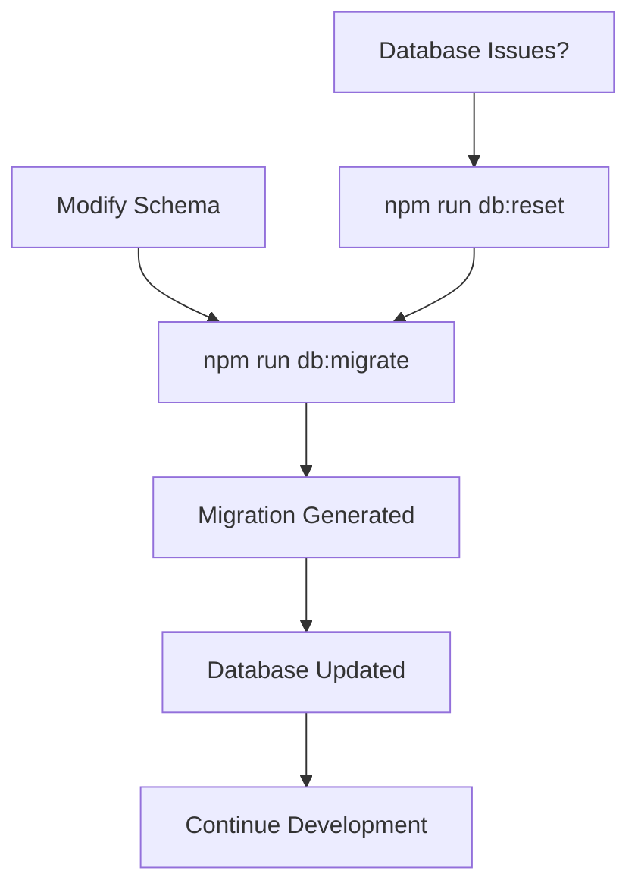
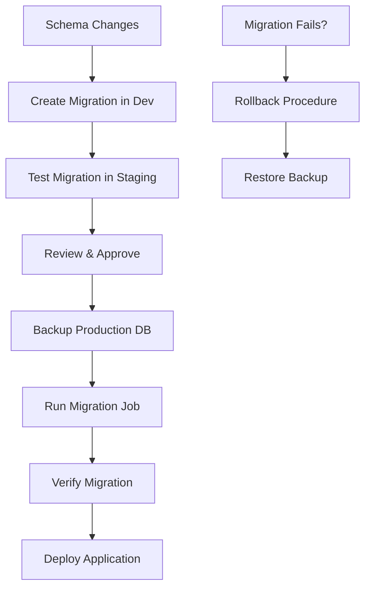

# Database Migrations Guide for Teamcast Backend

This guide covers the complete database migration strategy for all environments, from local development to production deployment in Kubernetes.

## 📋 **Overview**

The Teamcast backend uses Prisma for database management with a robust migration strategy that separates concerns between application startup and database migrations.

### **Key Principles**

1. **Separation of Concerns**: Migrations run separately from application startup
2. **Environment-Specific Behavior**: Different strategies for dev, staging, and production
3. **Safety First**: Production migrations include validation and backup recommendations
4. **Rollback Support**: Clear rollback procedures for all environments
5. **CI/CD Integration**: Migration validation in deployment pipelines

## 🏗️ **Architecture**

### **Components**

1. **Migration Script** (`scripts/db-migrate.sh`): Handles all migration logic
2. **Application Startup** (`scripts/app-start.sh`): Only starts the application
3. **Production Dockerfile** (`Dockerfile.production`): Application container
4. **Migration Dockerfile** (`Dockerfile.migration`): Migration-specific container
5. **Kubernetes Job** (`k8s/migration-job.yaml`): Production migration execution

### **Environment Strategy**

| Environment | Migration Method        | Schema Changes | Seeding           | Reset Allowed |
| ----------- | ----------------------- | -------------- | ----------------- | ------------- |
| Development | `prisma migrate dev`    | ✅ Allowed     | ✅ Dev data       | ✅ Yes        |
| QA          | `prisma migrate deploy` | ❌ Deploy only | ✅ Prod-like data | ✅ Yes        |
| Staging     | `prisma migrate deploy` | ❌ Deploy only | ✅ Prod-like data | ❌ No         |
| Production  | `prisma migrate deploy` | ❌ Deploy only | ⚠️ Optional       | ❌ No         |

## 🚀 **Getting Started**

### **Local Development**

#### **Initial Setup**

```bash
# 1. Install dependencies
npm install

# 2. Set up database
npm run db:migrate

# 3. Start development server
npm run dev
```

#### **Creating New Migrations**

```bash
# 1. Modify your Prisma schema files in prisma/schema/
# 2. Generate and apply migration
npm run migrate:dev

# OR use the migration script
npm run db:migrate
```

#### **Resetting Database (Development Only)**

```bash
# Reset database and apply all migrations
npm run db:reset

# OR using the script
./scripts/db-migrate.sh --reset
```

### **QA Environment**

#### **Local QA Testing**

```bash
# Start QA environment with Docker Compose
npm run docker:qa:build

# Check QA application
curl http://localhost:4301/api/monitoring/health

# Stop QA environment
npm run docker:qa:down
```

#### **QA Migration Testing**

```bash
# Set QA environment
export NODE_ENV=qa

# Test migrations in QA
npm run db:migrate

# Reset QA database if needed
npm run db:reset  # Allowed in QA environment
```

### **Production/Staging Deployment**

#### **Docker-based Deployment**

**Step 1: Build Images**

```bash
# Build application image
docker build -f Dockerfile.production -t teamcast-backend:latest .

# Build migration image
docker build -f Dockerfile.migration -t teamcast-migration:latest .
```

**Step 2: Run Migrations**

```bash
# Run migrations first
docker run --rm \
  -e DATABASE_URL="your-database-url" \
  -e NODE_ENV="production" \
  teamcast-migration:latest
```

**Step 3: Start Application**

```bash
# Start application after migrations
docker run -d \
  -e DATABASE_URL="your-database-url" \
  -e NODE_ENV="production" \
  -p 4300:4300 \
  teamcast-backend:latest
```

#### **Kubernetes Deployment**

**Step 1: Apply Migration Job**

```bash
# Run migrations
kubectl apply -f k8s/migration-job.yaml

# Check migration status
kubectl logs -n teamcast job/teamcast-migration
```

**Step 2: Deploy Application**

```bash
# Deploy application only after migrations succeed
kubectl apply -f k8s/deployment.yaml
```

## 🔧 **Scripts Reference**

### **NPM Scripts**

| Script                   | Description                            | Usage                    |
| ------------------------ | -------------------------------------- | ------------------------ |
| `npm run db:migrate`     | Run migrations for current environment | Development & Production |
| `npm run db:reset`       | Reset database (dev only)              | Development only         |
| `npm run db:status`      | Check migration status                 | All environments         |
| `npm run db:validate`    | Validate schema only                   | All environments         |
| `npm run migrate:dev`    | Development migration                  | Development only         |
| `npm run migrate:deploy` | Deploy existing migrations             | Staging & Production     |

### **Migration Script Options**

```bash
./scripts/db-migrate.sh [OPTIONS]

Options:
  --reset         Reset database (development only)
  --validate-only Only validate schema
  --status        Check migration status
  --skip-seed     Skip database seeding
  --help          Show help message
```

### **Application Script Options**

```bash
./scripts/app-start.sh

# No options - just starts the application with pre-flight checks
```

## 📊 **Migration Workflow**

### **Development Workflow**



### **Production Deployment Workflow**



## 🔍 **Monitoring & Troubleshooting**

### **Checking Migration Status**

```bash
# Local development
npm run db:status

# Docker container
docker run --rm \
  -e DATABASE_URL="your-db-url" \
  teamcast-migration:latest \
  ./scripts/db-migrate.sh --status

# Kubernetes
kubectl logs -n teamcast job/teamcast-migration
```

### **Common Issues**

#### **1. Migration Fails in Production**

**Symptoms:**

- Migration job fails with database errors
- Application can't connect to database

**Solution:**

```bash
# 1. Check migration status
kubectl logs -n teamcast job/teamcast-migration

# 2. Validate schema
kubectl run migration-debug --rm -it \
  --image=teamcast-migration:latest \
  --env="DATABASE_URL=your-db-url" \
  -- ./scripts/db-migrate.sh --validate-only

# 3. Check database connectivity
kubectl run db-test --rm -it \
  --image=postgres:15-alpine \
  -- psql "your-database-url" -c "SELECT version();"
```

#### **2. Application Can't Start**

**Symptoms:**

- Application container restarts repeatedly
- Health checks fail

**Solution:**

```bash
# 1. Check application logs
kubectl logs -n teamcast deployment/teamcast-backend

# 2. Check database migrations are applied
kubectl run migration-check --rm -it \
  --image=teamcast-migration:latest \
  --env="DATABASE_URL=your-db-url" \
  -- ./scripts/db-migrate.sh --status

# 3. Manually run Prisma generate if needed
kubectl exec -it deployment/teamcast-backend -- npx prisma generate
```

#### **3. Schema Drift Detected**

**Symptoms:**

- Development and production schemas don't match
- Migration status shows inconsistencies

**Solution:**

```bash
# 1. Generate a new migration to fix drift
npm run migrate:dev

# 2. Or reset development database to match production
npm run db:reset

# 3. Pull production schema (carefully!)
npx prisma db pull
```

## 🔄 **Rollback Procedures**

### **Development Rollback**

```bash
# 1. Reset to previous state
npm run db:reset

# 2. Or remove the last migration file and reset
rm prisma/schema/migrations/LATEST_MIGRATION_DIR
npm run db:reset
```

### **Production Rollback**

> ⚠️ **WARNING**: Production rollbacks should be planned and tested in staging first.

#### **Method 1: Database Restore (Recommended)**

```bash
# 1. Stop application
kubectl scale deployment teamcast-backend --replicas=0

# 2. Restore database from backup
# (This is database-specific - PostgreSQL example)
pg_restore -d production_db backup_file.dump

# 3. Update application to previous version
kubectl set image deployment/teamcast-backend \
  teamcast-backend=teamcast-backend:previous-version

# 4. Scale up application
kubectl scale deployment teamcast-backend --replicas=3
```

#### **Method 2: Migration Rollback (If Supported)**

```bash
# 1. Create rollback migration
npx prisma migrate dev --name "rollback_feature_xyz"

# 2. Test in staging first
kubectl apply -f k8s/migration-job.yaml -n staging

# 3. Apply to production
kubectl apply -f k8s/migration-job.yaml -n production
```

## 🛡️ **Security & Best Practices**

### **Database Security**

1. **Always backup before migrations**

   ```bash
   # PostgreSQL backup
   pg_dump -Fc database_name > backup_$(date +%Y%m%d_%H%M%S).dump
   ```

2. **Use read-only connections for status checks**
3. **Rotate database credentials regularly**
4. **Monitor migration execution time**

### **Migration Best Practices**

1. **Schema Changes**

   - Make backward-compatible changes when possible
   - Use feature flags for breaking changes
   - Test migrations with production-sized data

2. **Data Migrations**

   - Break large data migrations into chunks
   - Use transaction boundaries appropriately
   - Have rollback plans for data changes

3. **Testing**
   - Test migrations in staging environment
   - Validate application functionality after migration
   - Test rollback procedures

## 📈 **CI/CD Integration**

### **GitHub Actions Example**

```yaml
# .github/workflows/deploy.yml
name: Deploy

on:
  push:
    branches: [main]

jobs:
  validate-migrations:
    runs-on: ubuntu-latest
    steps:
      - uses: actions/checkout@v4
      - name: Setup Node.js
        uses: actions/setup-node@v4
        with:
          node-version: '18'

      - name: Install dependencies
        run: npm ci

      - name: Validate Prisma schema
        run: npm run db:validate

      - name: Check migration status
        run: |
          export DATABASE_URL="${{ secrets.STAGING_DATABASE_URL }}"
          npm run db:status

  deploy:
    needs: validate-migrations
    runs-on: ubuntu-latest
    steps:
      - name: Run migrations
        run: |
          kubectl apply -f k8s/migration-job.yaml
          kubectl wait --for=condition=complete job/teamcast-migration --timeout=600s

      - name: Deploy application
        run: kubectl apply -f k8s/deployment.yaml
```

### **GitLab CI Example**

```yaml
# .gitlab-ci.yml
stages:
  - validate
  - migrate
  - deploy

validate-migrations:
  stage: validate
  script:
    - npm ci
    - npm run db:validate
    - npm run db:status
  environment:
    name: staging

run-migrations:
  stage: migrate
  script:
    - kubectl apply -f k8s/migration-job.yaml
    - kubectl wait --for=condition=complete job/teamcast-migration --timeout=600s
  environment:
    name: production
  when: manual # Require manual approval for production migrations

deploy-app:
  stage: deploy
  script:
    - kubectl apply -f k8s/deployment.yaml
  environment:
    name: production
  dependencies:
    - run-migrations
```

## 📚 **Additional Resources**

- [Prisma Migration Guide](https://www.prisma.io/docs/concepts/components/prisma-migrate)
- [Kubernetes Jobs Documentation](https://kubernetes.io/docs/concepts/workloads/controllers/job/)
- [Database Backup Strategies](https://www.postgresql.org/docs/current/backup.html)
- [Teamcast Workload Identity Setup](./workload-identity-setup.md)

## 🆘 **Support**

For migration issues or questions:

1. Check logs: `kubectl logs -n teamcast job/teamcast-migration`
2. Validate schema: `npm run db:validate`
3. Check status: `npm run db:status`
4. Review this documentation
5. Contact the development team

---

**Remember**: Always test migrations in staging before applying to production!
